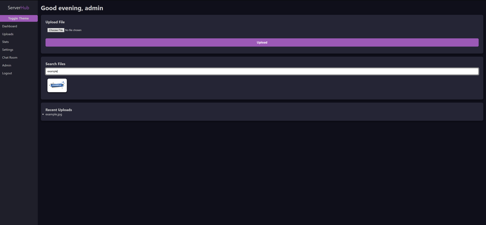
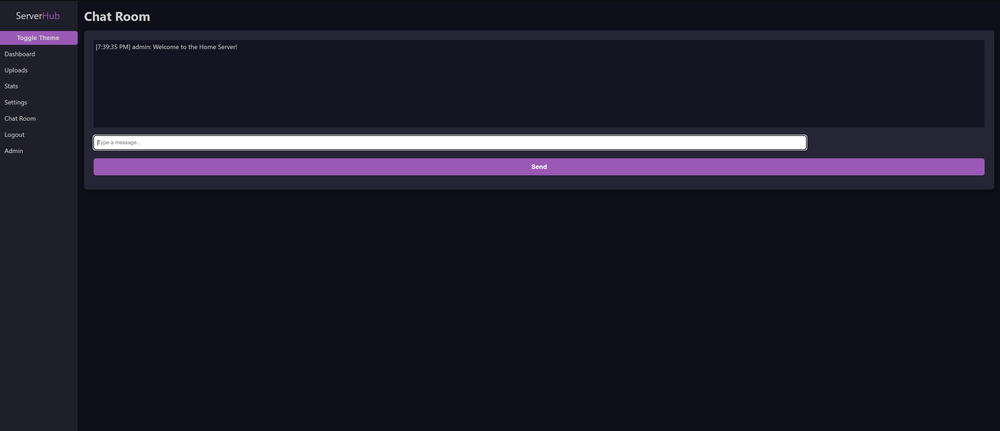
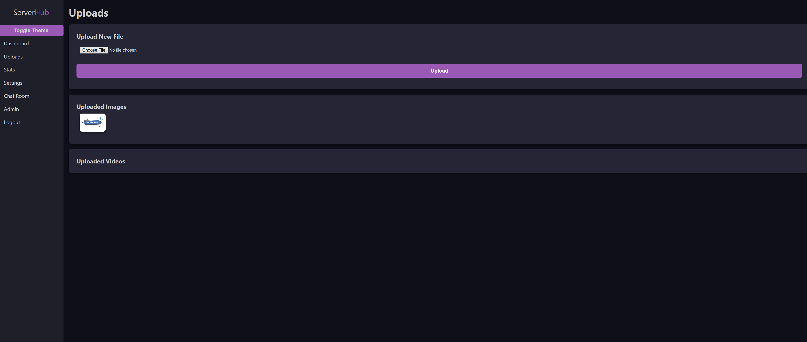
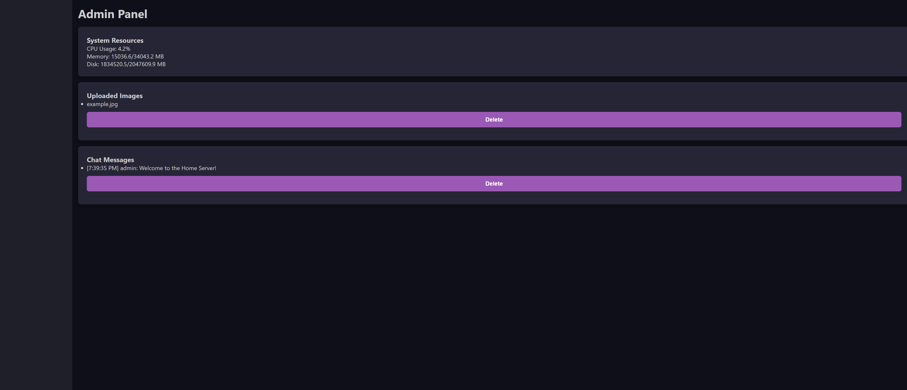

# 🏡 HomeServer

Welcome to **HomeServer** — your own private, personal server for photos, videos, and real-time chatting, right from the comfort of your local network. Built using **Go**, **HTML**, **CSS**, and **JavaScript**, this self-hosted app makes it fun and easy to manage your digital life in one place.

---

## ✨ Features

- 📸 Upload and view your **photos** and **videos**
- 💬 Built-in **chat room** for local network messaging
- 🔐 Admin dashboard for user control and settings
- 🖥️ Simple, sleek interface with minimal setup

---

## 📂 Project Structure

```
HomeServer/
├── static/              # Stylesheets and JavaScript
├── templates/           # HTML templates (rendered via Go)
├── uploads/             # Stores uploaded media
├── main.go              # Main application file
├── go.mod / go.sum      # Go dependencies
└── LICENSE
```

---

## 🚀 Getting Started

### 🔧 Requirements

- Go 1.18 or higher
- Works best on Linux or Unix-based systems

### 🛠️ Setup

1. Clone the repository:

```bash
git clone https://github.com/s-0-u-l-z/HomeServer.git
cd HomeServer
```

2. Run the server:

```bash
go run main.go
```

3. On first run, you'll be prompted to:

- Enter the number of users
- Set a name and password for each user

> 💡 **Admin default login**  
> Username: `admin`  
> Password: `server`

---

## 📸 Screenshots

| Home Page | Chat Room |
|-----------|-----------|
|  |  |

| Uploads Page | Admin Dashboard |
|--------------|-----------------|
|  |  |

> _💡 Place your screenshots in a `/screenshots` folder at the root of your repo._

---

## 🎯 Future Plans

- Add real-time system monitoring (CPU temp, power usage)
- Dark mode / theme customization
- Mobile-friendly layout

---

## 📜 License

This project is licensed under the [MIT License](LICENSE).

---

Enjoy your own slice of the cloud! ☁️
